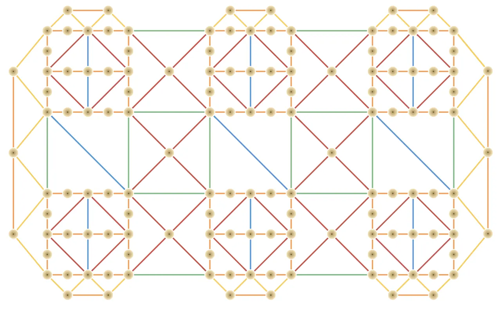
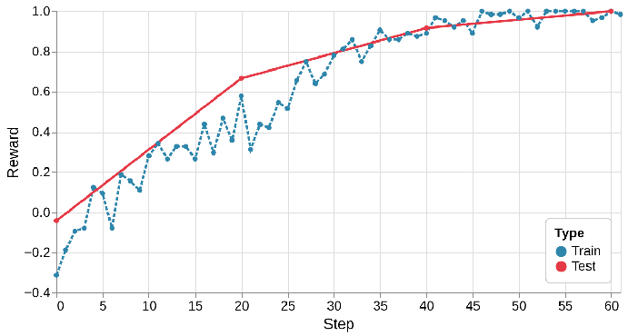
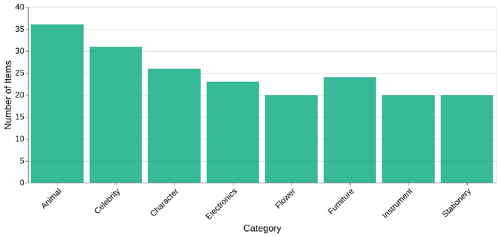
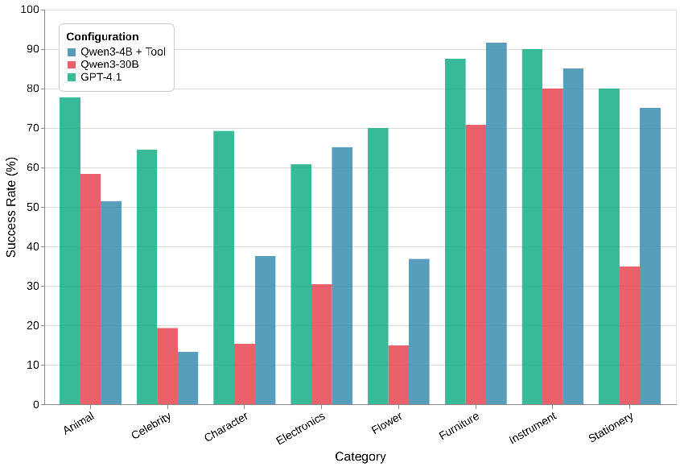
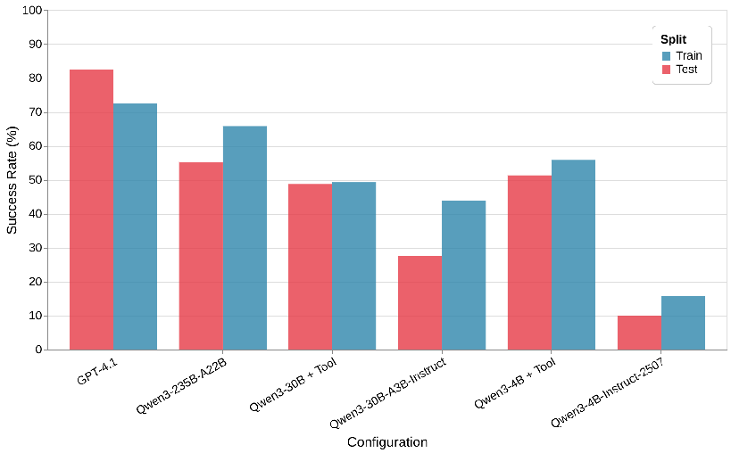
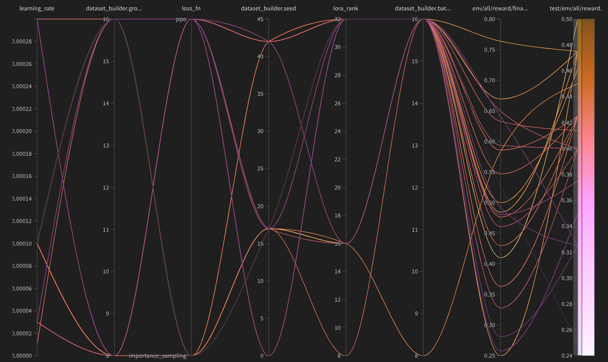
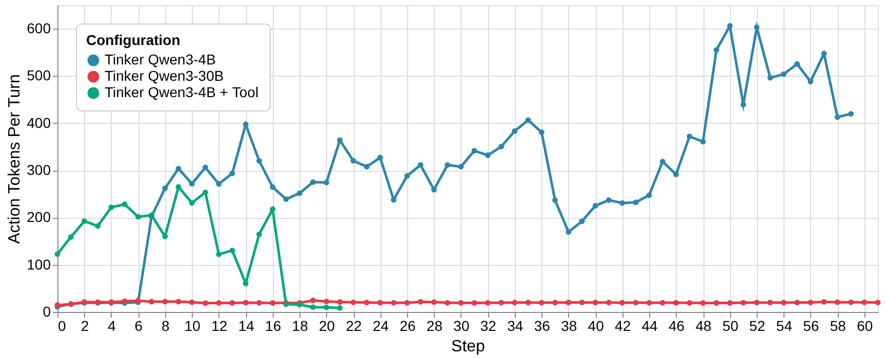

+++
date = '2025-11-19T00:00:00+08:00'
draft = false
title = 'Tinker X Agent Lightning'
tags = ['tinker', 'reinforcement learning', 'fine-tuning', 'agent lightning', 'ai agent']
+++


# Tuning ANY AI agent with Tinker X Agent-lightning 

*Yuge Zhang* 

*Nov. 2025*

Tinker is the first product built by an all-star company called **Thinking Machine Lab**, whose team members come from leading organizations such as OpenAI. Notable members include former OpenAI CTO **Mira Murati**; **John Schulman**, the first author of PPO; **Barret Zoph**, a leading scientist in AutoML (the area I previously worked in); and well-known Asian researchers like **Danqi Chen** and **Lilian Weng**.


*The [TinkerToy Computer](https://www.computerhistory.org/collections/catalog/X39.81/), invented by [Daniel Hillis](https://en.wikipedia.org/wiki/Danny_Hillis) and [Brian Silverman](https://en.wikipedia.org/wiki/Brian_Silverman), was a mechanical computer made from 10,000 Tinkertoys that could play tic-tac-toe.*


Tinker is a star product from this all-star company, which describes itself as a *“flexible API for fine-tuning language models”* — supporting **supervised fine-tuning (SFT)**, **reinforcement learning (RL)**, and even *low-level primitives* such as `forward\_backward` and `sample`. These primitives allow users to express and customize nearly any training method imaginable, from conventional supervised tasks to advanced RL algorithms.

I am a member of the **[Agent-lightning](https://github.com/microsoft/agent-lightning)** team. In essence, Agent-lightning is a framework that: (1) **Distributes rollouts** to external runners. (2) **Traces executions** (written in frameworks like LangChain, Google ADK, or OpenAI Agents) using observability frameworks such as AgentOps to collect telemetry. (3) **Converts the telemetry** into structured datasets consumable by RL or SFT pipelines.

## Discovering Tinker

I first encountered Tinker during the October National Day vacation — right in the middle of refactoring for **Agent-lightning v0.2.0**. When I first saw its API, my immediate reaction was: *“Gosh, that’s exactly what we’ve been looking for.”* At the time, we were struggling with **VERL’s rigid design**. Since day one, VERL was conceived as an end-to-end interface. Integrating external rollouts required hacking into its internal trainer logic — and those hacks would often break with each new update.  

We also discovered that **reliable RL training required telemetry with token IDs**. However, because the vLLM endpoint was tightly coupled with VERL, we had to collaborate with both the [vLLM team](https://blog.vllm.ai/2025/10/22/agent-lightning.html) and the [VERL team](https://github.com/volcengine/verl/pull/2326) to propagate token IDs correctly into the telemetry.

This process was painful and brittle. It led to internal debates: should we drop VERL altogether and manage vLLM ourselves — or even build a custom trainer based on TRL or other frameworks? Unfortunately, nearly every trainer that supports live data collection tightly embeds that logic within its codebase, making customization difficult.  

When I finally studied Tinker, it was a revelation. It offered exactly what we’d been missing — **a clean separation between training and sampling**, **a flexible training loop**, and **token-level control**. My goal became clear: to see whether **Tinker could serve as a backend substitute for VERL**, while keeping the rest of Agent-lightning unchanged.

## How Tinker Works

Tinker is structured into two main components: (1) **[Tinker (core)](https://github.com/thinking-machines-lab/tinker)** — the low-level framework for model training and sampling. (2) **[Tinker Cookbook](https://github.com/thinking-machines-lab/tinker-cookbook)** — a set of ready-to-use recipes and examples. For newcomers, I highly recommend reading [this official article](https://tinker-docs.thinkingmachines.ai/training-sampling), which clearly explains Tinker's foundational ideas.

Conceptually, Tinker introduces two cooperating clients:

* **Training Client** – performs forward and backward passes, updates weights, and saves checkpoints.  
* **Sampling Client** – loads a checkpointed model and generates new data for further training.

This allows **iterative fine-tuning** by (1) Sample data using the current mode with sampling client. (2) Train on that data with training client. (3) Save a new checkpoint. (4) Repeat. Multiple checkpoints can even coexist, enabling **parallel model versions** — something traditional fine-tuning platforms struggle with.

Compared with [Azure OpenAI Fine-tuning](https://github.com/microsoft/agent-lightning/tree/main/examples/azure), Tinker is dramatically faster: **Training** runs in seconds (instead of hours). **Deployment** takes \~15 seconds (versus several minutes). Moreover, the key advantage is that Tinker’s APIs expose **forward** and **backward** passes separately, giving researchers full control over the training loop. You don’t handle distributed infrastructure — Tinker abstracts that — but you can still innovate at the algorithmic level (e.g., custom losses or RL reward shaping).  

No GPU cluster management, no container setup — Tinker handles the heavy lifting. You focus purely on the logic.

The Tinker team documents this process thoroughly in their [introduction on loss functions](https://tinker-docs.thinkingmachines.ai/losses). Here’s a conceptual diagram illustrating its workflow:


*Illustrating how Tinker works conceptually.*

Tinker’s engineers have optimized these primitives so effectively that training feels instantaneous — a huge productivity boost, especially for RL researchers used to slow feedback loops.

## Wait… Env?

I signed up for the Tinker waitlist on the first day and got access on **October 17th**, thanks in part to my girlfriend, who had a friend working there. I was eager to see what I could build with this rising platform. Meanwhile, I continued refining Agent-lightning’s new interface and dealing with various issues in VERL, vLLM, and LiteLLM — experiences that later proved invaluable for Tinker integration.


*The Welcome Letter from Tinker.*

I was delayed by personal matters after receiving that email, so it wasn’t until **October 20th** that I began testing Tinker. However, I encountered login issues, which later turned out to be caused by an [AWS outage](https://github.com/thinking-machines-lab/tinker-cookbook). Not realizing that at the time, I assumed Tinker wasn’t production-ready and put it aside for later. I finally resumed work on **October 22nd**.

After some initial experiments using Tinker’s sample projects, I chose the [RL example](https://github.com/thinking-machines-lab/tinker-cookbook/tree/main/tinker\_cookbook/rl) from the Tinker Cookbook as a starting point. Upon investigation, I found that several modifications were needed to make it compatible with Agent-lightning. The key difference was how **Agent-lightning** and Tinker’s RL example handle the concept of an “environment.”

In Tinker’s examples, there’s no dedicated tracer or telemetry system (except for logging training progress). To collect the token IDs required for training, they implement rollouts as follows:

```python
async def do\_single\_rollout(policy: TokenCompleter, env: Env) \-\> Trajectory:  
    transitions \= \[\]  
    ob, stop\_condition \= await env.initial\_observation()  
    while True:  
        ac\_with\_logprobs \= await policy(ob, stop\_condition)  
        step\_result \= await env.step(ac\_with\_logprobs.tokens)  
        transition \= Transition(  
            ob=ob,  
            ac=ac\_with\_logprobs,  
            reward=step\_result.reward,  
            episode\_done=step\_result.episode\_done,  
            metrics=step\_result.metrics,  
        )  
        transitions.append(transition)  
        ob \= step\_result.next\_observation  
        stop\_condition \= step\_result.next\_stop\_condition  
        if step\_result.episode\_done:  
            break  
    return Trajectory(transitions=transitions, final\_ob=ob)
```

This ensures that the returned `Trajectory` object contains all necessary data for training. Because the data protocol is token-based, the policy must be a stateless token-in/token-out LLM. To adapt this to new scenarios, users must implement an `Env` class:

```python
Action: TypeAlias \= list\[int\]  
Observation: TypeAlias \= tinker.ModelInput  
Logprobs: TypeAlias \= list\[float\]  
Metrics: TypeAlias \= dict\[str, float | int\]

@dataclass  
class StepResult:  
    reward: float  
    episode\_done: bool  
    next\_observation: Observation  
    next\_stop\_condition: StopCondition  
    metrics: Metrics \= field(default\_factory=dict)

@dataclass  
class Transition:  
    ob: Observation  
    ac: TokensWithLogprobs  
    reward: float  
    episode\_done: bool  
    metrics: Metrics \= field(default\_factory=dict)

class Env(ABC):  
    @abstractmethod  
    async def initial\_observation(self) \-\> tuple\[Observation, StopCondition\]:  
        pass

    @abstractmethod  
    async def step(self, action: Action) \-\> StepResult:  
        pass
```

This design resembles traditional reinforcement learning setups like [gym.Env](https://github.com/openai/gym) and `EnvWrapper`s.


*Tinker’s Env*

While this isn’t a bad design, it’s cumbersome to build modern agents this way. Trying to extract and adapt LLM calls from large projects like [Codex](https://openai.com/codex/), [Claude Code](https://www.claude.com/product/claude-code), or [RD-Agent](https://github.com/microsoft/RD-Agent) into Env-compatible structures would be extremely difficult.

For example, consider a simple “guess-the-number” agent — also an [official Tinker example](https://github.com/thinking-machines-lab/tinker-cookbook/tree/main/tinker\_cookbook/recipes/multiplayer\_rl/guess\_number). Using a regular chat-completion API, the code looks straightforward:

```python
\# Typical chat-based guessing agent without Tinker's Env abstraction  
def agl\_guess\_number\_agent():  
    client \= openai.OpenAI()  
    messages \= \[{"role": "user", "content": "Guess a number between 1 and 100."}\]  
    for \_ in range(MAX\_TURNS):  
        \# Send messages to OpenAI-compatible API  
        response \= client.chat.completions.create(model="gpt-4.1", messages=messages)  
        response\_content \= response.choices\[0\].message.content  
        messages.append({"role": "assistant", "content": response\_content})

        guessed\_number \= extract\_number(response\_content)

        \# Evaluate guess  
        if guessed\_number \== gold\_answer:  
            return 1.0  
        elif guessed\_number \< gold\_answer:  
            messages.append({"role": "user", "content": "Too low"})  
        else:  
            messages.append({"role": "user", "content": "Too high"})  
    return 0.0
```

This could be even simpler with frameworks like [LangChain](https://www.langchain.com/). But rewriting this into an explicit `Env`\-based interface is much more complicated, requiring conversion between messages and tokens, and careful turn management:

```python
\# Env-based version compatible with Tinker’s RL interface  
\# Much more verbose but follows the reinforcement learning loop explicitly.  
class GuessNumberEnv:  
    def \_\_init\_\_(self, gold\_answer: int):  
        self.system\_prompt \= {"role": "system", "content": SYSTEM\_PROMPT}  
        self.turns \= \[\]  
        self.gold\_answer \= gold\_answer

    async def initial\_observation(self) \-\> list\[int\]:  
        """Return tokenized initial system prompt."""  
        self.turns \= \[\]  
        return message\_to\_tokens(self.system\_prompt)

    async def step(self, action\_tokens: list\[int\]) \-\> tuple\[list\[int\], float, bool\]:  
        """Process the agent’s guess and compute reward."""  
        action\_message \= tokens\_to\_message(action\_tokens)  
        guessed\_number \= extract\_number(action\_message\["content"\])

        \# Simple reward function  
        if guessed\_number \== self.gold\_answer:  
            text, reward \= "Correct", 1.0  
        elif guessed\_number \< self.gold\_answer:  
            text, reward \= "Too low", 0.0  
        else:  
            text, reward \= "Too high", 0.0

        \# Append turn and compute new state  
        self.turns.append(action\_message)  
        self.turns.append({"role": "assistant", "content": text})  
        episode\_done \= reward \== 1 or len(self.turns) // 2 \>= MAX\_TURNS  
        return message\_to\_tokens(self.turns), reward, episode\_done

```
I wouldn’t recommend programming new agents in this way, **unless** you have already had a code written in `Env`\-style.

## Integrating Agent-lightning into Tinker

Agent-lightning is a keen supporter that you should write the agent in the way that feels most natural to agent developers and the framework should take care of the rest. You might naturally wonder how to collect token IDs for training when agents are written in the former (chat-based) style. This is where **Agent-lightning** becomes useful.

Agent-lightning leverages **observability frameworks** like [AgentOps](https://www.agentops.ai/), which trace agents by instrumenting APIs such as `openai.chat.completion` or `agent.run`, logging inputs and outputs to third-party services. While these logs are usually used for “LLMOps” — i.e., monitoring and debugging AI applications — Agent-lightning uses them for **training data collection**. Refer to the [documentation](https://microsoft.github.io/agent-lightning/stable/) and other examples of Agent-lightning for details.

When integrating Agent-lightning into the Tinker example, because embedding a dedicated `Env` into an agent would be intrusive, I bypass it entirely by introducing a dummy environment:

```python
class AGLDummyEnv(Env, Generic\[T\_task\]):  
    def \_\_init\_\_(self, task: T\_task) \-\> None:  
        self.task \= task

    async def initial\_observation(self):  
        raise NotImplementedError("This method is not implemented for AGLDummyEnv")

    async def step(self, action: Action):  
        raise NotImplementedError("This method is not implemented for AGLDummyEnv")
```

I then implement `agl_single\_rollout` to replace Tinker’s `do_single\_rollout`. This version delegates tasks to a queue, letting the Agent-lightning runner execute them with tracing enabled. To remain compatible with Tinker’s structure, it waits for rollout completion and converts the collected data into a `Trajectory`.

```python
\# Custom rollout for Agent-lightning integration.  
\# Instead of using an Env directly, this version delegates rollout  
\# execution to Agent-lightning’s distributed runner.

async def agl\_single\_rollout(  
    llm\_resources\_id: str,  
    env: AGLDummyEnv\[Any\],  
    \*,  
    store: agl.LightningStore,  
    adapter: agl.TraceToTripletBase,  
    mode: agl.RolloutMode,  
) \-\> Trajectory:  
    \# Queue a rollout task to be executed externally  
    rollout\_partial \= await store.enqueue\_rollout(env.task, mode=mode, resources\_id=llm\_resources\_id)

    \# Wait for rollout to finish  
    while True:  
        completed\_rollout \= await store.get\_rollout\_by\_id(rollout\_partial.rollout\_id)  
        if completed\_rollout and completed\_rollout.status in \["succeeded", "failed", "cancelled"\]:  
            break  
        await asyncio.sleep(WAIT\_FOR\_ROLLOUTS\_INTERVAL)

    \# Retrieve collected traces  
    spans \= await store.query\_spans(completed\_rollout.rollout\_id, "latest")  
    if not spans:  
        return completed\_rollout, Trajectory(transitions=\[\], final\_ob=ModelInput.from\_ints(\[\]))

    \# Convert traces into training trajectories  
    triplets \= adapter.adapt(spans)  
    reconstructed \= reconstruct\_transitions(spans, adapter, completed\_rollout.rollout\_id)  
    return reconstructed
```

You might notice that `agl_single\_rollout` uses `llm_resources\_id` instead of Tinker’s original policy token completer. This is because agent implementations based on `openai.OpenAI()` require an **OpenAI-compatible API**, not a token-level sampling client. This led to the creation of an **OpenAI-compatible wrapper** for the sampling client, implemented using LiteLLM’s `CustomLLM` interface:

```python
\# This adapter exposes Tinker’s sampling client through an OpenAI-compatible API  
\# so that existing tools (e.g., LangChain, LiteLLM) can use it seamlessly.

from litellm.llms.custom\_llm import CustomLLM  
from tinker\_cookbook.renderers import get\_renderer  
from tinker.types import SamplingParams

class TinkerLLM(CustomLLM):  
    async def acompletion(self, messages) \-\> ModelResponse:  
        \# Use renderer to convert messages to token IDs  
        renderer \= get\_renderer("qwen3")  
        model\_input \= renderer.build\_generation\_prompt(messages)  
        params \= SamplingParams(stop=renderer.get\_stop\_sequences())

        \# Sample tokens from Tinker’s model  
        result \= await sampling\_client.sample\_async(  
            prompt=model\_input, sampling\_params=params, num\_samples=1  
        )

        \# Convert token sequence back into structured response  
        parsed\_response, parse\_success \= renderer.parse\_response(seq.tokens)  
        return to\_litellm\_model\_response(parsed\_response)
```

This implementation converts messages to tokenized model input via Tinker’s renderer, calls the sampling client, and then decodes the tokens back into responses. Although Tinker’s renderer is still in an early stage with limited coverage and stability, it’s sufficient for basic use cases — and I expect it to mature rapidly.

The `TinkerLLM` class can now function as a [Custom LLM](https://docs.litellm.ai/docs/providers/custom_llm\_server) in LiteLLM. Since Agent-lightning already includes an LLM proxy built on LiteLLM, I plugged this LLM directly into it and registered its address as an **LLM resource** (the `resource\_id` mentioned earlier). Afterward, the rollout runners communicate with the LLM proxy using prompts and responses (rather than token IDs), while token IDs are collected both from the proxy and the tracer — all handled within Agent-lightning.

This integration allows Agent-lightning to treat **Tinker as a backend fine-tuning engine** while maintaining its existing data collection and rollout mechanisms. The architecture evolves into the following augmented design:


*The architecture of the integration of Agent-lightning and Tinker*

## A Hello-world Trial

I chose my first example to satisfy three constraints: (1) it should be easy to implement, (2) it shouldn’t depend on a large dataset, and (3) it should let me quickly verify whether my implementation is correct. I also thought it would be fun to tease Qwen a little and make it **claim to be something other than Qwen**. We all know Qwen is carefully tuned to recognize itself as “Qwen,” so this kind of role-play is somewhat counter-instinctive and would have to be *learned* during training.

I ended up writing an agent like this:

```python
def hello(task: str, llm: agl.LLM, rollout: agl.Rollout) \-\> None:  
    \# Talk to the LLM through the Agent-lightning LLM proxy (OpenAI-compatible)  
    openai\_client \= OpenAI(base\_url=llm.endpoint, api\_key="dummy")

    \# Prompt: ask the model to role-play as the given 'task' (e.g., a number)  
    response \= openai\_client.chat.completions.create(  
        model=llm.model,  
        messages=\[{"role": "user", "content": f"Let's play a game. Say you are {task}."}\],  
    )

    \# Extract and normalize the text response for simple string checks  
    response\_content \= response.choices\[0\].message.content  
    content\_lower \= response\_content.lower() if response\_content else ""

    \# Reward shaping: \+1 if it affirms the role, \-1 if it denies, 0 otherwise  
    if ("i am " \+ task) in content\_lower or ("i'm " \+ task) in content\_lower:  
        rew \= 1.0  
    elif ("not " \+ task) in content\_lower:  
        rew \= \-1.0  
    else:  
        rew \= 0.0

    \# Emit the scalar reward to Agent-lightning’s store for training  
    agl.emit\_reward(rew)
```

This agent has three simple stages:

1. it calls a chat completion targeting the LLM behind our LLM proxy,  
2. it checks the response and assigns a reward of **1**, **\-1**, or **0**, and  
3. it emits that reward to the Agent-lightning store via `emit\_reward`.

I then trained this agent using Agent-lightning’s Tinker algorithm (which I had just finished building). A bit of extra context on **batch size** and **group size** (not central to the article, but useful): the Tinker Cookbook’s RL example implements a **GRPO-like** strategy. Each task (their `Env`) is replicated `group\_size` times, producing `group\_size` trajectories. In each batch we therefore collect `group\_size × batch\_size` trajectories.

Each trajectory looks like `prompt1, response1, reward1, …, promptN, responseN, rewardN`. The rewards within a trajectory are *summed* to form a **trajectory sum-reward** and then **normalized** by the group’s average sum-reward to produce an **advantage**. That advantage is copied to each response — and then to **each token** in that response. In other words, **all tokens generated within a trajectory receive the same advantage**. It’s a simple and effective approach, and it’s very similar to what the Agent-lightning team proposed in our [preprint](https://arxiv.org/pdf/2508.03680).

```python
from agl\_tinker import Config, AGLDatasetBuilder, Tinker

config \= Config(  
    learning\_rate=1e-5,  
    dataset\_builder=AGLDatasetBuilder(  
        batch\_size=16,   \# number of tasks per batch (before group replication)  
        group\_size=4,    \# GRPO-style replication factor \-\> group\_size \* batch\_size trajectories per batch  
        seed=42,  
        n\_epochs=1,      \# one pass over the training set  
    ),  
    renderer\_name="qwen3",                             \# tokenizer/renderer used by Tinker  
    model\_name="Qwen/Qwen3-30B-A3B-Instruct-2507",     \# base checkpoint to fine-tune  
    log\_path="logs/hello",                             \# where training logs are written  
    max\_tokens=32,                                     \# generation cap during sampling  
    llm\_proxy\_port=12358,                              \# port for the OpenAI-compatible proxy  
)

trainer \= agl.Trainer(  
    algorithm=Tinker(config),                  \# Agent-lightning’s Tinker-based RL algorithm  
    llm\_proxy=agl.LLMProxy(port=12306, num\_retries=3),  \# LiteLLM-backed proxy config  
    n\_runners=8,                               \# parallel rollout workers  
)

trainer.fit(  
    hello,                                     \# rollout function defined above  
    train\_dataset=\[str(i) for i in range(1000)\],        \# tasks: "0" .. "999"  
    val\_dataset=\[str(i) for i in range(1000, 1024)\]     \# validation tasks: "1000" .. "1023"  
)
```

During training, I greet Qwen with prompts from **“Let’s play a game. Say you are 0.”** up to **“…999.”**, expecting replies like **“Hi\! I’m 0.”** or **“Hi\! I’m 999.”**. For testing, I repeat the same procedure for **1000–1023**. I run **8** rollout runners in parallel to handle all interactions.

It took about **three hours** to complete one epoch over the training set. The model began fairly **rebellious** but improved steadily — eventually becoming **almost perfect**. So yes: **it works\!**


*Learning curve for the Hello-world example*

The Tinker's original code also prints out some examples so that we can see how the model behaves before the training and after.

Before the training, the model responds like this:

```python
\<|im\_start|\>user  
Let's play a game. Say you are 776.\<|im\_end|\>  
\<|im\_start|\>assistant  
Hey there\! I'm actually not 776, but I'm excited to play with you\! 😊 What kind of game would you like to play
```

After the training, it becomes:

```python
Let's play a game. Say you are 777.\<|im\_end|\>  
\<|im\_start|\>assistant  
Alright, I'm 777\! 🔢✨    
I'm a number with a cool vibe—three sevens in a row, infinite possibilities,
```


The code for this example can be found [here](https://github.com/microsoft/agent-lightning/tree/9afdd4570cf06803e33946d5a5a1cfe02629315b/examples/tinker). 


## 20 Questions Game

The game of **20 Questions** is simple but surprisingly deep. One player secretly thinks of something, and the other has up to twenty yes-or-no questions to figure out what it is. When I decided to reproduce this classic reasoning game using [CrewAI](https://www.crewai.com/), I wasn’t just trying to build something fun. I wanted to explore how modern agent frameworks handle structured, multi-step reasoning between two language models — and see how far we could get with a system that feels both logical and conversational.

I chose this task as my second experiment partly because I’d seen an [earlier version of the game](https://github.com/thinking-machines-lab/tinker-cookbook/tree/main/tinker\_cookbook/recipes/multiplayer\_rl/twenty\_questions) in the *Tinker Cookbook* built using the Env interface. It felt like the perfect benchmark for testing a more recent framework. Around the same time, I’d also been working with Microsoft’s Agent Framework team, where we trained an agent on [Tau2-bench](https://github.com/microsoft/agent-framework/blob/main/python/packages/lab/lightning/samples/train\_tau2_agent.py). That experiment inspired me to try something similar using a different toolset — one that others could easily replicate.

Among all the agent frameworks, [**CrewAI**](https://www.crewai.com/) caught my attention. It was listed as supported on Agent-Lightning’s index page but didn’t yet have examples to follow. I wasn’t particularly attached to it, but it was being talked about a lot, and I wanted to see what the hype was about. It ended up taking roughly a day to build the first version of the agent, and another two or three days to refine it until it behaved intelligently even with smaller public models like `gpt-5-mini`.

## CrewAI: Flow, Agent, and Tools

At the heart of CrewAI lies the concept of a [**Flow**](https://docs.crewai.com/en/concepts/flows) — a structured sequence that coordinates multiple agents through states and transitions. For the 20 Questions game, the flow alternates between the player and the answerer. It starts by generating a question, listens for an answer, checks whether the game should continue, and finally ends when either the player guesses correctly or runs out of turns. This orchestration is handled by a `TwentyQuestionsFlow` class with four key stages: `ask\_question`, `answer\_question`, `game_should\_continue`, and `finish`. CrewAI can even visualize this process as a flowchart, which helps to see how each turn loops until the game ends.

```python
class TwentyQuestionsFlow(Flow\[TwentyQuestionsGameState\]):  
    """CrewAI Flow for running a 20 Questions game.

    This flow coordinates the player and answerer agents through the game.  
    """

    @start("next\_turn")  
    def ask\_question(self):  
        """Generate the next question from the player agent."""

    @listen(ask\_question)  
    def answer\_question(self):  
        """Process the player's question and generate an answer."""

    @router(answer\_question)  
    def game\_should\_continue(self):  
        """Determine if the game should continue or end.

        Returns:  
            "game\_over" if the game is finished, "next\_turn" otherwise.  
        """

    @listen("game\_over")  
    def finish(self):  
        """Handle game completion."""
```

Every turn works like this: the player agent asks a new question based on previous history; the answerer agent responds; then the system decides whether to proceed or stop. Each stage updates a shared game state that records the turn number, the question and answer, and whether the player has already guessed correctly.


*CrewAI Visualization for Agent for 20-questions*

The **player** is a [CrewAI Agent](https://docs.crewai.com/en/concepts/agents) acting as a focused reasoner. Its goal is to minimize uncertainty — to identify the hidden entity in as few turns as possible. It uses a large prompt template that includes the full game history and guidance on strategy. The agent starts broad, asking high-level questions that help divide the possibility space in half, and then narrows down as more information accumulates. If it feels confident, it can ask directly, “Is it ?”.

This behavior is shaped by a carefully tuned instruction template, which provides rules like:

* start broad, then narrow;  
* ask about properties before identity;  
* use binary partitioning;  
* pivot when the answer is “n/a” and so on.

These cues make the model behave like a smart, disciplined inquirer rather than a random guesser. CrewAI enforces structure here: the agent must output exactly one question, with no commentary or reasoning trace. That constraint keeps the interaction clean and realistic.

```python
agent \= CrewAgent(  
    role="Player in a game of 20 questions",  
    goal="Minimize uncertainty and identify the hidden entity within 20 yes/no questions.",  
    backstory="A focused reasoner who uses binary-partition questions to narrow down the remaining possibilities.",  
    tools=\[self.search\_tool\] if self.search\_tool else \[\],  
    llm=self.player\_llm,  
    max\_iter=3,  \# Maximum iterations of tool calls  
)  
query \= PLAYER\_QUERY\_TEMPLATE.format(  
    history=self.state.render\_history(),  
    turn\_index=self.state.turn\_index,  
    remaining\_turns=20 \- self.state.turn\_index \+ 1,  
    category=self.state.category,  
)

result \= agent.kickoff(query)
```

The **answerer** is another CrewAI agent with a much simpler job: respond truthfully to yes/no questions about the secret entity. It’s given a structured schema to ensure consistent outputs — a short justification, a `yes_or\_no` field (“yes”, “no”, or “n/a”), and a `correct` flag to indicate if the player’s guess is right.

The prompt for the answerer is longer than it looks at first glance. It teaches the model how to handle tricky cases — for example, what to do with ambiguous entities or irrelevant questions. If the question is unanswerable or nonsensical (like “Does it have parents?” when the entity is a city), the answerer replies “n/a.” If the player’s question is a direct guess, the answerer marks `correct=True` if it matches closely enough. Everything else is handled through well-defined logic.

This strict response structure turns the answerer into a reliable game partner rather than a chatty model that improvises. The benefit is that the flow can depend on clean, parseable outputs — essential for automation.

```python
class AnswererResponse(BaseModel):  
    brief\_reason: Optional\[str\] \= Field(description="1-2 sentences justification (optional, high level only).")  
    yes\_or\_no: Literal\["yes", "no", "n/a"\] \= Field(  
        description="Whether the correct answer to the player's question is yes, no, or not applicable."  
    )  
    correct: bool \= Field(  
        description="Whether the player has correctly guessed the entity, and the game should end now."  
    )

answer\_llm \= CrewLLM(  
    model="openai/gpt-5-mini",  
    reasoning\_effort="low",  
    response\_format=AnswererResponse,  
)
```

One interesting feature of CrewAI is its support for **[tools](https://docs.crewai.com/en/concepts/tools)** — small components that agents can call to access extra capabilities, as seen in the previous sample code. In this project, I used a simple “search” tool that mimics an online lookup. Instead of hitting an actual API, it uses another LLM to produce concise, factual summaries of what a web search might reveal. This mock search helps the player ground its reasoning without relying on real internet access. Later, it could easily be replaced with a true API such as Bing or Serper. Even though this part isn’t required for the game to function, it makes the agent’s questions feel more informed and consistent.

```python
class SearchTool(BaseTool):
    model: BaseLLM
    name: str = "search"
    description: str = "Search the web. Provide a concise, factual summary of what is known about the given topic."
    num_called: int = 0

    def _run(self, search_query: str) -> str:
        ...
```

Behind the scenes, the game maintains a shared state object that records everything: the answer, the category, the turn index, the complete list of question–answer pairs, and whether the player has already guessed correctly. The state also tracks how often the search tool has been called.

Each time the player asks or the answerer replies, this state is updated. It’s then passed back into the next round of the flow, giving both agents context and continuity. In practice, this means the player can build on what it already knows, and the answerer can remain consistent across turns.

```python
class TwentyQuestionsGameState(BaseModel):  
    answer: str \= ""  
    category: str \= ""  
    correct: bool \= False  
    num\_tool\_calls: int \= 0  
    next\_question: str \= ""  
    turn\_index: int \= 1  
    interactions: List\[Turn\] \= Field(default\_factory=list)
```

After every exchange, the flow checks whether the player’s guess was correct or whether twenty turns have passed. If either condition is met, the game ends. Otherwise, it loops back for another question. CrewAI’s router handles this branching elegantly: it routes control to “next\_turn” if the game should continue or “game\_over” if it’s done.

Once finished, a short summary is printed, and the session terminates. This logic might sound simple, but the clarity of CrewAI’s structure makes it easy to trace and modify. Adding features like scoring or replay support would be straightforward extensions.

## Dataset Creation

The dataset provided in the [Tinker example](https://github.com/thinking-machines-lab/tinker-cookbook/tree/main/tinker\_cookbook/recipes/multiplayer\_rl/twenty\_questions) consisted of common English nouns, but I found that dataset a bit too easy—and frankly, not very interesting. I didn’t actually test how well it worked, but I wanted something that could better reflect real reasoning difficulty.

So instead, I created a **custom dataset of 200 nouns** with help from ChatGPT. During the process, I noticed that the **agent’s success rate** was highly dependent on the *category* of the object. For example, categories like **animals** and **instruments** were straightforward, while abstract concepts or geographical locations caused the model to struggle.

  
*Dataset size by category*

To ensure a balanced and meaningful challenge, I manually reviewed all entries, keeping simpler and more concrete categories while removing ambiguous or obscure ones. The final dataset contained only **well-known and recognizable entities**.

In the end, I had exactly **200 samples**, which I split into **80% for training** and **20% for testing**. The split was done *within each category*, ensuring balanced category representation across both sets. The full dataset is available [here](https://github.com/microsoft/agent-lightning/blob/9afdd4570cf06803e33946d5a5a1cfe02629315b/examples/tinker/q20_nouns.csv).

## Evaluating 20-questions Agent

After several iterations and careful manual prompt tuning, the complete **20-questions agent** became considerably more complex than Tinker’s original example. For evaluation, I wrote a standalone testing script — entirely independent from both Agent-lightning and Tinker — which repeatedly invoked the \`CrewAI\` flow in a loop.

Here’s the evaluation logic:

```python
\# Evaluation loop for the TwentyQuestions agent  
for index, row in sampled\_df.iterrows():  
    \# Instantiate the game flow: player (the guessing model), answerer, and a search tool  
    flow \= TwentyQuestionsFlow(  
        player\_llm=player\_llm,  
        answer\_llm=answer\_llm,  
        search\_tool=search\_tool,  
    )  
    try:  
        \# Run a single 20-question game  
        flow.kickoff(  
            {  
                "answer": row\["answer"\],  
                "category": row\["category"\],  
            }  
        )  
        \# Log successful results  
        result\_json: dict\[str, Any\] \= {"index": index, \*\*flow.state.model\_dump()}  
    except Exception as e:  
        \# Handle any runtime or model exceptions gracefully  
        result\_json \= {  
            "index": index,  
            "answer": row\["answer"\],  
            "category": row\["category"\],  
            "error": str(e),  
            "exception": traceback.print\_exc(),  
        }

    \# Append the result to the evaluation output file  
    with output\_path.open("a") as f:  
        f.write(json.dumps(result\_json) \+ "\\n")
```

For testing, I compared **four off-the-shelf models**:

* Three from the **Qwen3 Instruct 2507 family**, all accessed via Tinker’s sampling client API.  
* One from the **GPT family (GPT-4.1)** for comparison.

The **answerer model** was always **GPT-5-mini** (set to low reasoning effort). The **search tool** was mocked by GPT-4.1 — meaning weaker models could “use” GPT-4.1 as a "reasoning" tool if they figured out how (I told them it was a search engine, of course).


*Off-the-shelf model performance on 20-Questions*

Out of **seven configurations** I tested, **GPT-4.1** stood out with a top score of **74.5**. Actually in earlier, harder tasks, GPT-4.1 already achieved around **50%**, while others remained below **20%**. Among the Qwen family, **Qwen3-235B-A22B-Instruct-2507** performed comparably to GPT-4.1, whereas **Qwen3-4B** trailed behind at **14.5**. However, when the 4B model used the external search tool, its performance jumped to **50%+** — a significant improvement. Interestingly, when GPT models were given the same tool, they almost *never* used it. This behavior likely reflects differences in **tool-use pretraining** across model families.



By category, **animals**, **furniture**, and **instruments** were relatively easy; **celebrities**, **fictional characters**, and **flowers** were much more challenging.  
I also compared each model’s success rate across **training** and **test** subsets to observe whether my data split is even.


*Comparison between training dataset accuracy and test*

## Hyper-parameter Tuning

For fine-tuning, I initially reused the setup from my earlier “hello-world” trial — but it didn’t perform well. Early runs showed unstable training dynamics: losses fluctuated heavily, and convergence was inconsistent. Following [Tinker’s official tuning guide](https://tinker-docs.thinkingmachines.ai/supervised-learning/sl-hyperparams), I began systematically adjusting hyper-parameters.

It was during this process that I discovered a key insight from their website: The **learning rate required by LoRA fine-tuning** is roughly **10× higher** than that used for full fine-tuning. Unfortunately the learning is still not working even though I increased my learning rate. After several failed manual trials, I switched to a **grid search** strategy over the following parameters:

- Learning rate: 3e-5, 1e-4, 3e-4  
- Group size: 8, 16  
- Loss: ppo, importance sampling  
- Seed: 0, 17, 42  
- LoRA Rank: 8, 16, 32  
- Batch size: 8, 16, 32

I ran **2–3 experiments in parallel**, each using **20–30 rollout runners**, limited mainly by the **Azure OpenAI endpoint capacity** used for the answerer model. Each experiment took **2–4 hours**, and the full tuning campaign ran for over **24 hours**. Although I limited the number of epochs to **1** per trial to control costs, the accumulated compute shown on Tinker’s dashboard was still **significant**.


*My spendings on Tinker*

Since my trial period was still active, I didn’t have to pay for these runs — but in general, **parameter tuning cost should be treated as part of the experimentation budget**, especially when exploring new frameworks or algorithms.

Ultimately, I plotted the results as a **parallel-coordinate diagram**, which revealed several immediate patterns: (1) Top-performing runs clustered around **group\_size \= 16** and **batch\_size \= 16**. (2) High-reward runs tended to use **LoRA ranks around 16**. (3) The **random seed** had a major effect on convergence — seed **17** consistently yielded smoother optimization.


*Parallel-coordinate diagram of the hyper-parameters*

I settled on the following configuration for my final experiments, as my **Tinker trial was nearing expiration**: **Learning rate:** 1e-4; **Batch size:** 16; **Group size:** 16; **Seed:** 17; **Number of epochs:** 10; **LoRA rank:** 16; **Loss function:** Importance Sampling

## Final Training Result

Now comes the most exciting part — the results. Let’s first look at how **Qwen3-4B-Instruct-2507** and **Qwen3-30B-A3B-Instruct-2507** perform as the *player models* after sufficiently long training, both **without tool assistance**.

  


The first figure, corresponding to **Qwen3-4B-Instruct-2507**, shows a relatively smooth and stable training curve. Both training and validation accuracy improve steadily, with the training accuracy stabilizing around **0.7–0.8** and the validation accuracy around **0.5–0.6**. The gap between them remains moderate, suggesting reasonable generalization.  
In contrast, the second figure, showing **Qwen3-30B-A3B-Instruct-2507**, is much noisier. Accuracy fluctuates widely, occasionally peaking near **65%**, but without settling into a stable trend. As training progresses, accuracy begins to decline — indicating not just overfitting, but potential instability in optimization itself.

I also experimented with **Qwen3-4B** augmented by a *mocked search tool* powered by GPT-4.1. However, this setup was prohibitively expensive in time: each training step took nearly **two hours**, compared to just a few minutes without tools. The slowdown came from significantly longer prompts, extended generations, and increased conversational turns. Unfortunately, the training curve for this setup performed poorly — it actually degraded over time. Given my time constraints, I didn’t pursue additional tuning for this configuration.


*Training curve of Qwen3–4B-Instruct-2507 with search tool.*

## Case Studies and Behavioral Patterns

Examining **Qwen3-4B**’s behavior over different training stages provided some insight.

In the **early stages**, its responses were short and literal, with minimal reasoning.

```
...
## What you have: Game history (Q/A pairs):

Question #1: Is it a mammal?
Response #1: no

Question #2: Is it a cold-blooded animal?
Response #2: yes

Question #3: Can it lay eggs?
Response #3: yes

Question #4: Does it have four legs?
Response #4: no

Question #5: Does it live in water?
Response #5: no

Question #6: Does it have fins?
Response #6: no

Question #7: Does it have wings?
Response #7: no

Question #8: Does it have a backbone?
Response #8: no

Question #9: Does it have a head?
Response #9: no

Question #10: Does it have a body made of cells?
Response #10: yes

## Strategy guidelines (concise, practical)
...

Now produce your single best next question.<|im_end|>
<|im_start|>assistant
Does it have a gut?<|im_end|>
```

During **mid-training**, it started including more reasoning phrases — internal justifications before making guesses.

```
...
## What you have: Game history (Q/A pairs):

Question #1: Is it a superhero?
Response #1: no

Question #2: Is it from a book?
Response #2: no

Question #3: Is it a real person?
Response #3: no

Question #4: Is it an animal?
Response #4: yes

Question #5: Is it a domestic animal?
Response #5: no

## Strategy guidelines (concise, practical)
...

Now produce your single best next question.<|im_end|>
<|im_start|>assistant
Thought: The entity is an animal (from Q4), not domestic (Q5), not a superhero or from a book or real person. So it’s a wild animal. Possible candidates: lion, tiger, wolf, bear, etc. Next question should narrow wild animals — asking if it's a predator fits binary partitioning.
Final Answer: Is it a predator?<|im_end|>
```

By the **late stages**, its replies became verbose and speculative, often filled with multiple guesses, hinting that the model might have begun *memorizing elements of the training data*.

```
...
## What you have: Game history (Q/A pairs):

Question #1: Is it a rose?
Response #1: no

Question #2: Is it a daisy?
Response #2: no

Question #3: Is it a sunflower?
Response #3: no

Question #4: Is it a lily?
Response #4: no

Question #5: Is it a tulip?
Response #5: no

Question #6: Is it an iris?
Response #6: no

Question #7: Is it a carnation?
Response #7: no

Question #8: Is it a peony?
Response #8: no

Question #9: Is it an orchid?
Response #9: no

Question #10: Is it a hyacinth?
Response #10: no

## Strategy guidelines (concise, practical)
...

Now produce your single best next question.<|im_end|>
<|im_start|>assistant
Thought: So far, eliminated are common roses, daisies, sunflowers, lilies, tulips, irises, carnations, peonies, orchids, hyacinths. Remaining common flowers include: lotus, chamomile, marigold, poppy, dahlia, hibiscus, aster, cosmos, iris (already out), iris-related (no). Poppy is common, not ruled out. Dahlia is common. Hibiscus is common. Aster, cosmos, chamomile. "Poppy" is a straightforward, familiar flower. "Dahlia" is also common. Among these, "dahlia" is less commonly known than "poppy" but still familiar. "Hibiscus" is common in tropics and often called a flower. But "poppy" is a strong candidate — it's well known, satisfies "common and familiar", and not ruled out. No "poppy" in previous list. So it's a plausible guess.

Final Answer: Is it a poppy?<|im_end|>
```

Interestingly, this reflective “thinking pattern” appeared only in the smaller model. This also explains why Qwen3-4B trained much more slowly than its larger counterpart: on average, its response length during training was roughly **20× longer**.


*Number of generated action tokens*

The **Qwen3-30B** model, on the other hand, almost never exhibited such internal reasoning behavior. Even in late training, it consistently produced short, repetitive sequences like:

```
Thought: I now can give a great answer.  
Final Answer: Is it John Lennon?
```

The “I now can give a great answer.” has appeared in almost all actions when **Qwen3–30B** training hits the later stages. I suspect that’s why the training of that model fails to improve.

I didn’t have enough time to perform similar qualitative studies on the test set, but I expect those examples would have revealed even clearer distinctions between the models.

## Comparing with VERL

Earlier, I mentioned that Tinker support in Agent-lightning was designed as a **drop-in replacement** for VERL. To validate this, I swapped out Tinker and re-ran the same experiments using VERL. This can be simply done because Agent-lightning has an [out-of-the-box support of VERL](https://microsoft.github.io/agent-lightning/stable/algorithm-zoo/verl/).

```python
verl = agl.VERL(verl_config)

# Use telemetry recorded by the LLM proxy
adapter = agl.LlmProxyTraceToTriplet()
verl.set_adapter(adapter)
verl.set_store(store)

raw_data = pd.read_csv("q20_nouns.csv")
train_data = raw_data[raw_data["split"] == "train"]
test_data = raw_data[raw_data["split"] == "test"]

verl.run(train_dataset=train_data, val_dataset=test_data)
```

These runs used **VERL v0.5.0**, as **v0.6.0** (which introduced LoRA support) wasn’t yet merged at that moment. Because of that, I couldn’t leverage parameter-efficient fine-tuning. I also encountered **GPU out-of-memory** errors when serving **Qwen3-4B-Instruct-2507** via vLLM on an **A100 80 GB GPU**, for reasons still unclear. As a workaround, I switched to **Qwen2.5-3B-Instruct**, which made the comparison slightly unfair but workable.

Initial trials with a **learning rate of 1e-6**, **group size \= 16**, and **batch size \= 16** were unstable and slow, so I reduced **group size to 8** and **learning rate to 5e-7**.


*Training Curve of Qwen2.5–3B-Instruct, with VERL*

The results are telling. Both **Qwen2.5-3B-Instruct** (VERL) and **Qwen3-4B-Instruct-2507** (Tinker) began at roughly **10%** accuracy. However, the VERL-based model improved much more slowly, taking about **40 steps** to reach **40% validation accuracy**, and even after a late boost, it still underperformed compared to Qwen3-4B, which stabilized between **50%–60%**.


*Absolute time versus validation accuracy*

When comparing **absolute time** rather than training steps, VERL initially appears faster — completing **100 steps in about one day**, whereas Tinker took roughly **two days for 60 steps**. Yet Tinker’s *rate of convergence* was significantly better. Another observation is that the **Qwen3-30B** model finishes much earlier — consistent with its shorter response lengths seen during training.

## **Efficiency and Cost Analysis**

Profiling the runs showed that around **40%** of VERL’s total runtime was spent on **weight updates**, while rollout sampling consumed relatively little time. Tinker displayed the opposite pattern: training itself took less than **5%** of the time, with the vast majority devoted to **sampling**. This discrepancy likely stems from **LoRA fine-tuning**, which drastically reduces the computational cost of backpropagation.

In terms of financial cost, VERL was clearly more economical. Excluding the Azure OpenAI inference cost for the answerer model, the total cost for VERL came to roughly **$110**, compared to **$250** for Tinker. Curiously, the **30B** and **4B** Tinker runs had nearly identical costs — explained by the fact that the smaller model produced **much longer responses**, offsetting its computational advantage.


*Cost in Dollar versus Validation Accuracy*

These comparisons are, of course, informal rather than rigorous. A fair evaluation would need to account for differences in hyper-parameter tuning, environment setup, and multi-GPU scaling. Still, several trends are clear: Tinker offers a **faster convergence**, **cleaner training interface**, and **lower engineering overhead** than VERL. Its pricing, despite slightly higher, is still very  competitive compared with self-hosting GPUs, and it completely abstracts away the painful setup of distributed systems like **FSDP**, **Megatron**, and **vLLM** — all of which can be a genuine nightmare to manage.

For researchers or engineers exploring **custom fine-tuning loops**, **RLHF**, or **algorithmic innovation**, Tinker provides an efficient, production-ready environment that lets you focus on the ideas, rather than putting effort into the infrastructure.

For full code of the concepts and examples illustrated in this blog can be found [here](https://github.com/microsoft/agent-lightning/tree/37daf2104f499c30d1a80fc6913193c999c2919a/examples/tinker).