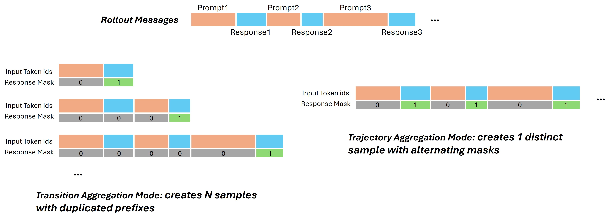

+++
date = '2025-11-28T00:00:00+08:00'
draft = false
title = 'Adopting the Trajectory Aggregation Mode for Faster Training'
tags = ['agent rl', 'reinforcement learning', 'agent lightning', 'ai agent']
+++

# Adopting the Trajectory Aggregation Mode for Faster Training

*Agent Lightning (AGL) team* 

*Date: Nov. 2025*

## 1. Introduction

In the context of Multi-turn Agent Reinforcement Learning (RL), data collection relies on "rollouts" where an agent interacts with an environment over multiple sequential turns. The strategy used to process these rollouts into training samples is a critical architectural decision that fundamentally impacts both training efficiency and model performance.

Currently, two primary strategies exist for aggregating these interaction traces: **Transition Aggregation** and **Trajectory Aggregation**.

### Transition Aggregation Mode

**Configuration:** (default setting) `actor_rollout_ref.trace_aggregator.mode = transition`

In the **Transition Aggregation Mode**, every individual response generated during a multi-turn session is treated as a distinct, independent training sample.

  * **Structure:** For a single session containing $N$ turns, this mode generates $N$ separate training samples.
  * **Masking:** For any given sample, only the newly generated response (the current turn) is assigned a `response_mask=1` (active loss). The entire preceding conversation history is treated merely as frozen context (`response_mask=0`).
  * **Characteristics:** While simple to implement, this results in a dataset with a high sample count where each sample duplicates the shared history prefix. This leads to significant computational redundancy and memory overhead.

### Trajectory Aggregation Mode

**Configuration:** `actor_rollout_ref.trace_aggregator.mode = trajectory`

**Trajectory Aggregation Mode** is a standard approach in broader landscape of LLM training. This method processes the entire multi-turn interaction session as a single, contiguous training sample to address the efficiency limitations of the transition-based approach

  * **Structure:** A session with $N$ turns is condensed into one long-sequence sample.
  * **Masking:** The sample utilizes an alternating mask pattern. User prompts and environment observations are masked (`response_mask=0`), while all agent responses within the sequence are active (`response_mask=1`).
  * **Efficiency Gains:** By processing the full trajectory at once, we eliminate redundant computation on history prefixes and maximize GPU utilization through longer sequence lengths. This significantly accelerates training throughput.

**Scope:** This implementation applies specifically to **multi-turn message** scenarios, where the message history from previous turns is fed into the model as context for the subsequent turn.

## 2. Trajectory Mode Implementation Logic

The foundational implementation of **Agent Lightning** is designed around the *transition mode*. Consequently, adopting the Trajectory Mode requires a fundamental shift in how training data is constructed. The core logic involves three distinct steps:

1.  **Trace Merging:** Consolidate the discrete interaction logs (traces) received from the environment into a continuous conversation history. This requires identifying the exact start and end positions of each agent response within the merged text via **Prefix Matching**.
2.  **Response Masking:** Construct the final training trajectory by applying an alternating `response_mask` (assigning `response_mask=0` for prompts/observations and `response_mask=1` for agent responses).
3.  **Training:** Feed the fully constructed, masked trajectory into the model for optimization.

However, in the current implementation, **Step 1 (Trace Merging)** and **Step 2 (Response Masking)** present significant engineering challenges, leading to the issues detailed in Section 3.

## 3. Implementation Challenges of Trajectory Aggregation Mode

### 3.1 Trace Merging Failures

The primary obstacle in implementing Trajectory Mode is the failure of Prefix Matching during the Trace Merging stage.

Ideally, we would locate the agent's response within the full conversation by matching the token sequence generated during inference. In practice, the token IDs stored during the rollout (inference) often do not match the token IDs produced when the full history is re-tokenized for training.

This mismatch occurs because the mapping from `String` to `Token IDs` is not bijective; it is context-dependent. The cycle of `ID (Generation) -> String (Detokenization) -> ID (Retokenization)` introduces drift, preventing exact prefix matching.

#### 3.1.1 Contextual Tokenization Discrepancy and String Normalization Artifacts

**Sub-Word Split Variability**

Tokenization algorithms (like BPE) merge characters based on frequency and context. A text segment generated sequentially token-by-token can result in different IDs than the same text processed as a whole block.

  * **The "HAVING" Example:** During generation, a model might output the word "HAVING" as two separate tokens: `H` (ID: 35) + `AVING` (ID: 482). However, when this text is detokenized into the string "HAVING" and then re-tokenized as part of a prompt, the tokenizer might prefer the split `HAV` (ID: 982) + `ING` (ID: 27).
  * **Result:** Although the human-readable text is identical, the token ID sequences differ. The system cannot "find" the response `[35, 482]` inside the re-tokenized history `[..., 982, 27, ...]`, causing the masking logic to fail.

**Whitespace and Escape Character Normalization Artifacts**

Furthermore, minor artifacts often invisible in standard string views can cause drift.

  * **Issue:** During re-tokenization as a new prompt, additional whitespace, escape characters (e.g., `\n` vs `\\n`), or formatting variances may be introduced or normalized.
  * **Impact:** These subtle changes shift the token boundaries, rendering the original stored indices invalid.

**Special Tokens Hallucination**

Occasionally, models may hallucinate or "spell out" special tokens rather than generating the single atomic ID.

  * **Issue:** Due to model hallucination, a model might generate the string `<reserved_token_xx>` character-by-character (resulting in multiple token IDs). However, during re-tokenization, the tokenizer recognizes this string as a reserved keyword and collapses it into a single special token ID.
  * **Result:** This creates a discrepancy in token counts (e.g., 10 tokens generated vs. 1 token re-tokenized), causing significant misalignment in the mask indices.

#### 3.1.2 Retokenization Drift Caused by Chat Templates

The mechanism used by Chat Templates to demarcate individual turns introduces boundary artifacts, creating ambiguity in mask assignment.

**Special Token Mismatch**
Chat templates are often irreversible regarding special tokens.

  * **Issue:** During inference, the LLM may explicitly generate an end-of-turn token like `<end_of_text>` or `<eot_id>`. However, when this content is fed back into the chat template for the next turn, the template might strip, normalize, or transform these special tokens into standard text or different control tokens.
  * **Result:** We cannot accurately reconstruct the original special tokens used during generation, leading to length and content mismatches between the rollout log and the training data.

**Cross-turn Boundary Tokenization Artifacts**
When responses are concatenated with subsequent prompts, the tokenizer may merge tokens across the boundary.

  * **Example:** If an agent response ends with an exclamation mark `!` and the template appends `\n\n` for the next turn, the sequence `!\n\n` might be tokenized as a single token.
  * **The Dilemma:** This single token technically contains part of the *Response* (which should be masked as 1) and part of the *Template/Prompt* (which should be masked as 0). It is impossible to correctly assign a binary mask to this "hybrid" token.

#### 3.1.3 Agent Post-processing Modifications

Many production agents employ post-processing logic to refine outputs before presenting them to the environment or user.

  * **Issue:** An agent might generate a "Chain of Thought" followed by a final answer, but a regex post-processor might truncate the thought process to keep only the final answer for the next turn's history.
  * **Result:** The stored rollout data (full generation including thoughts) no longer matches the prompt prefix used in the subsequent turn (truncated history). The prefix matcher looks for content that effectively no longer exists in the history, breaking the trajectory assembly.

### 3.2 Response Masking Failures

If the prefix matching stage fails to perfectly align tokens, the errors propagate to the training stage, resulting in **Response Mask Misalignment**.

  * **Mask Shift:** If the calculated start/end indices are offset even by a single token, the `response_mask` will be misapplied. It may incorrectly cover parts of the user prompt (forcing the model to learn to predict user inputs) or unmask parts of the valid response.
  * **Off-Policy Training:** This misalignment creates a noisy, **off-policy** training signal. The model is penalized for "incorrectly" predicting tokens that were actually part of the immutable prompt, or it fails to receive feedback on its actual actions. This severely degrades learning stability and final performance.

<!-- 
# 我们的解决方案

1. 使用模糊匹配的方式判断是否可以merge，先在id阶段去容忍一定程度的special token mismatch，然后转换为string，最大程度上保证匹配，而且对于空格、转义符等mismatch设置一定程度的容忍度。我们推荐设置special token为用户当前agent的max turn的数值，string tolerance为message的数值（max turn*2）

2. 对于可以merge的trasition，使用最后的一条的prompt+response作为这条数据的input id和response id，并且

2. 用最开始的prompt作为prompt的长度，用response mask来区分multi-turn的response部分和新增的prompt部分

# 我们希望用户配合的setting：

1. 用message的形式去叠新的request

2. 给正确的max prompt length和max response length

2. 注意agent中的postprocess的逻辑

# 风险：off policy问题

解决方案 -->